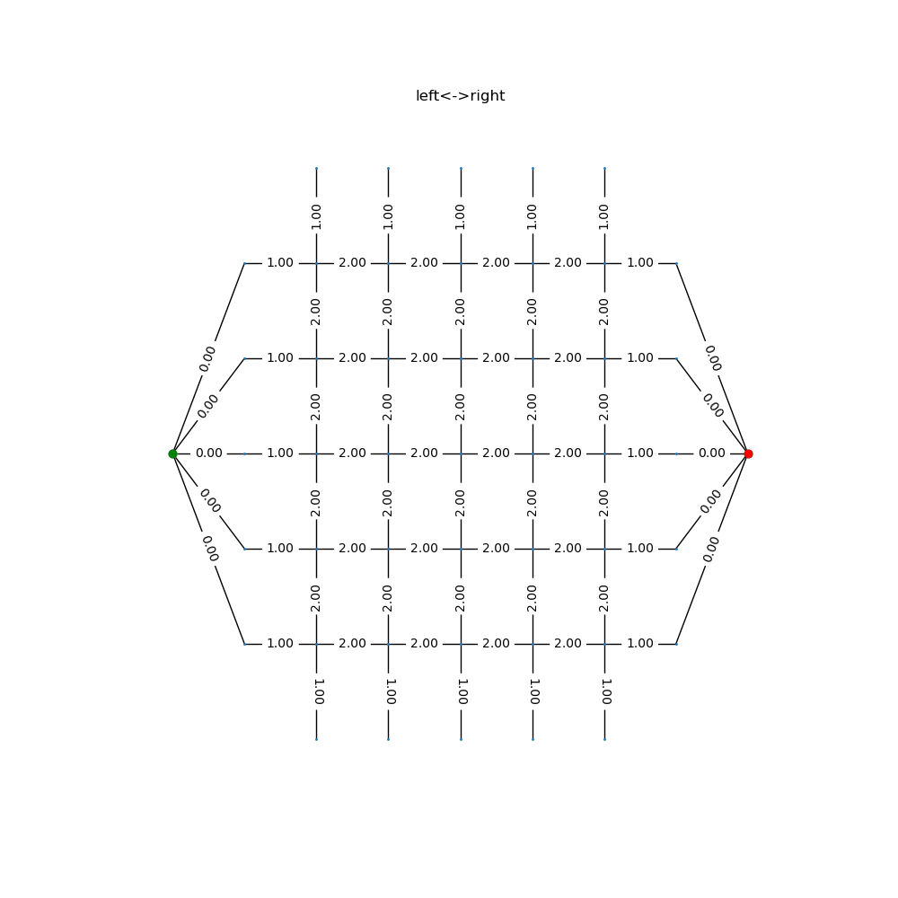

# Resistor Network 

## Solve equivalent resistance(s) for any network 
> Using [Star-Mesh transform](https://en.wikipedia.org/wiki/Star-mesh_transform )

## 2D grid equivalent resistance with Bond propagation [1]
> Using $\Delta-Y$ <=> [$Y-\Delta$ transform](https://en.wikipedia.org/wiki/Y-%CE%94_transform)
* Currently calculates between 2-edges ['left','right','top','bottom']
* 2D Lattice data 
  * Function mapping lattice data to horizontal and vertical resistors

[1] D. J. Frank and C. J. Lobb, *Highly efficient algorithm for percolative transport studies in two dimensions*, [Phys. Rev. B **37**, 302 (1988)](https://journals.aps.org/prb/abstract/10.1103/PhysRevB.37.302).

